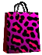

# MoxieRevere

Website made for MoxieRevere.com
using <a href="http://angularjs.org">Angularjs</a> and <a href="https://github.com/snapjay/ngCart">ngCart</a> created a shopping website 
The site uses an array that stores the item's information
<ul>
<li><b>id</b></li>
<li><b>name</b></li>
<li><b>image</b></li>
<li><b>price</b></li>
<li><b>available</b></li>
<li><b>size</b></li>
</ul>
If the avaiable amount = 0 then the item is removed from the view and the next item will takes its place.
This is handled by this filter

```
 app.filter('myFilter', function () {
    return function (items, count) {
            var result = [];
            for (var i = 0; i < items.length && result.length < count; ++i) {
                if (items[i].available > 0) result.push(items[i]);
            }
            return result;
        };
    });
```

in the ngCart you pass the information using ngRepeat

```
	<div ng-repeat="all in item.items |myFilter:3"  class="allItems">
		<div class="allItemsBox" role="listbox">
		<ul>
			<ul class="oneItem addcart1 pinkGrad">
			<li class="white2 ">{{all.name}}</li>
			<li class="white2">{{all.size}}</li>
			<li class="white2 ">{{all.price|currency}}</li>
			</ul>
			<ul class="oneItem">
			
			</ul>
			<ul class="oneItem addcart pinkGrad">
			
   			<li class="{{all.id}} white2 ">Add to Cart</li>
		
			     <ngcart-addtocart id="{{all.id}}" name="{{all.name}}" price="{{all.price}}" quantity="1" quantity-max="{{all.available}}"></ngcart-addtocart>   
			</ul>
  		</ul>

		</div>
	
		</div>
		```
